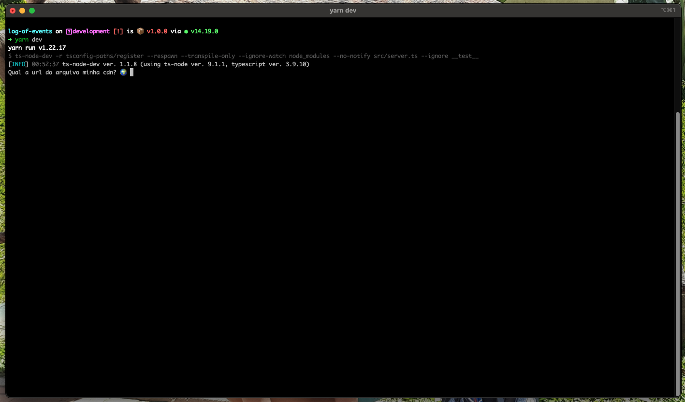
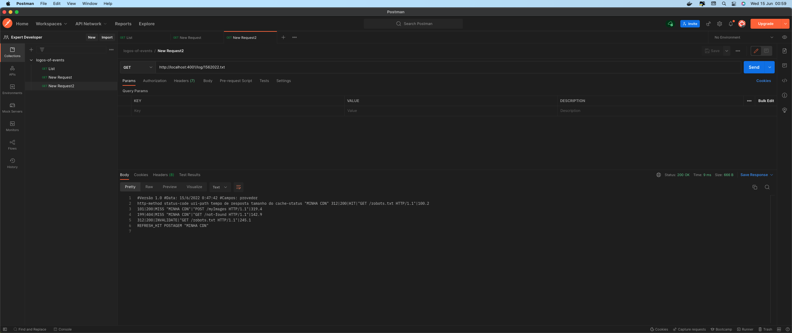

# Log of Events

Cli para converter os logs da cdn.

## Instruções

```
yarn && yarn dev
```



Adicione a url da cdn no terminal para gerar o log, após a geração do log é aberto um server onde é possível acessar o .txt convertido via http através do endereço abaixo.

```
http://localhost:4001/log/exemplo.txt
```

Obs: No projeto temos uma de pasta logs, onde se encontra os arquivos gerados.


